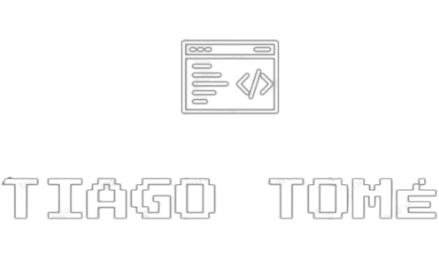

#  My Portfólio

  
  
  
  
  
  
  
  

> Status do Projeto: :white_check_mark: (concluido) | :warning: (em desenvolvimento) | :x: (não iniciada)

### Tópicos
:small_blue_diamond: [Descrição do Projeto](#writing_hand-descrição-do-projeto) :white_check_mark:

:small_blue_diamond: [Objetivo](#dart-objetivo) :white_check_mark:

:small_blue_diamond: [Funcionalidades](#video_game-funcionalidades) :white_check_mark:

:small_blue_diamond: [Captura de Tela](#camera_flash-captura-de-tela) :white_check_mark:

:small_blue_diamond: [Tecnologias Utilizadas](#hammer_and_wrench-tecnologias-utilizadas) :white_check_mark:

:small_blue_diamond: [Disponível em](#globe_with_meridians-disponível-em) :white_check_mark:

## :writing_hand: Descrição do Projeto 

 Este é o meu portfólio pessoal desenvolvido com React. O site foi criado para apresentar meus projetos, habilidades e experiências profissionais de forma organizada e interativa. Ele serve como uma vitrine digital do meu trabalho e um meio de contato para potenciais empregadores e colaboradores. 

## :dart: Objetivo 

 O objetivo principal do portfólio é exibir minhas competências como desenvolvedor, demonstrando minha capacidade de criar interfaces modernas e funcionais. Além disso, ele facilita o acesso às minhas informações de contato e permite que visitantes conheçam mais sobre minha trajetória profissional. 

## :video_game: Funcionalidades 
- Navegação Intuitiva: Menu de navegação para fácil acesso a diferentes seções, como projetos, habilidades e contato;
- Exibição de Projetos: Seção dedicada para mostrar detalhes dos projetos que desenvolvi, com links para visualização;
- Informações de Contato: Links das principais redes sociais para que visitantes possam enviar mensagens;
- Responsividade: Layout adaptável para garantir uma boa experiência de usuário em dispositivos móveis e desktops.

## :camera_flash: Captura de Tela 

 
  

## :hammer_and_wrench: Tecnologias Utilizadas 
- ReactJS;
- HTML5;
- CSS3;
- JavaScript.

## :globe_with_meridians: Disponível em 
https://portfoliotiagoo.netlify.app/

## Licença
The [MIT License]() (MIT)

Copyright :copyright: 2023 - Tiago Tomé
